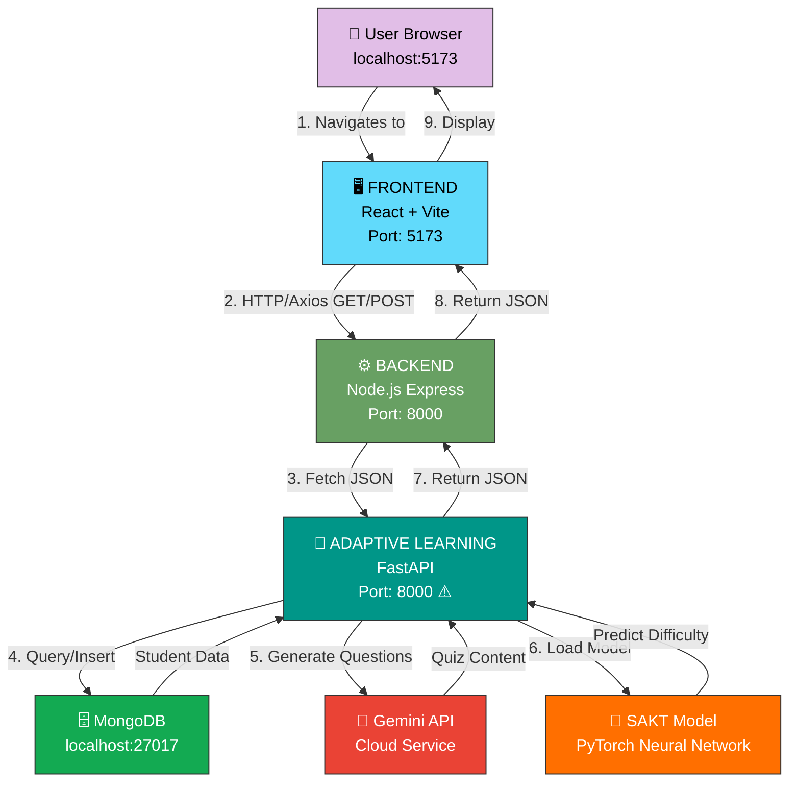
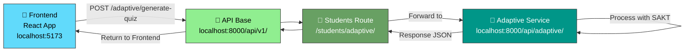
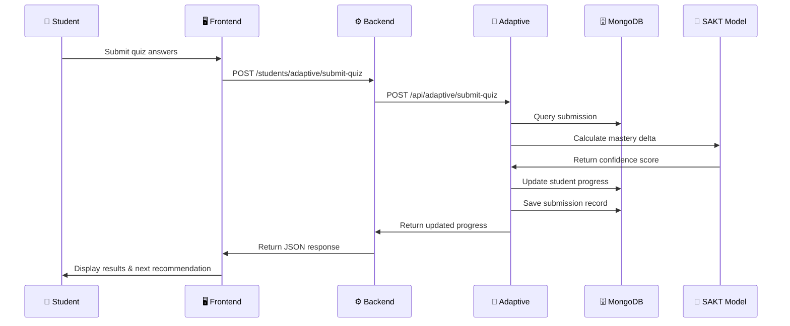

# Architecture Diagram

## Current Connection Architecture



## Endpoint Flow Diagram



## Component Communication

```
┌─────────────────────────────────────────────────────────────────┐
│                     Frontend (React)                             │
│                    localhost:5173                               │
│                                                                  │
│  axios.create({                                                 │
│    baseURL: http://localhost:8000/api/v1/                      │
│  })                                                              │
└────────────────┬────────────────────────────────────────────────┘
                 │
                 │ HTTP Request
                 │ POST /students/adaptive/generate-quiz
                 │
                 ▼
┌─────────────────────────────────────────────────────────────────┐
│                Backend (Express)                                │
│               localhost:8000                                    │
│                                                                  │
│  router.post('/students/adaptive/generate-quiz', (req, res) => {│
│    const fastapUrl = process.env.FASTAPI_URL;                  │
│    fetch(`${fasapiUrl}/api/adaptive/generate-quiz`)            │
│  })                                                              │
└────────────────┬────────────────────────────────────────────────┘
                 │
                 │ HTTP Request (Internal)
                 │ POST /api/adaptive/generate-quiz
                 │
                 ▼
┌─────────────────────────────────────────────────────────────────┐
│            Adaptive Learning (FastAPI)                           │
│            localhost:8000 ⚠️ CONFLICT!                           │
│                                                                  │
│  @router.post('/generate-quiz')                                │
│  async def generate_quiz(req: QuizRequest):                    │
│    - Load SAKT model                                            │
│    - Predict difficulty                                         │
│    - Call Gemini API for questions                             │
│    - Save to MongoDB                                            │
│    - Return response                                            │
└─────────────────────────────────────────────────────────────────┘
                 │
                 └─> MongoDB (Query/Insert)
                 └─> Gemini API (Generate content)
                 └─> SAKT Model (Predict mastery)
```

## Port Configuration Issues

```
CURRENT STATE (🚨 CONFLICT):
━━━━━━━━━━━━━━━━━━━━━━━━━━━
Frontend:           5173
Backend:            8000  ◄── Both trying to use 8000!
Adaptive Learning:  8000  ◄── PORT CONFLICT!


RECOMMENDED FIX:
━━━━━━━━━━━━━━━━━━━━━━━━━━━
Frontend:           5173
Backend:            8000
Adaptive Learning:  8001  or  5000

OR use Docker Compose:
Backend Container:     8000 (internally)
Adaptive Container:    8000 (internally, different container)
Traffic routed via container networking
```

## Data Flow Example: Student Quiz Submission


