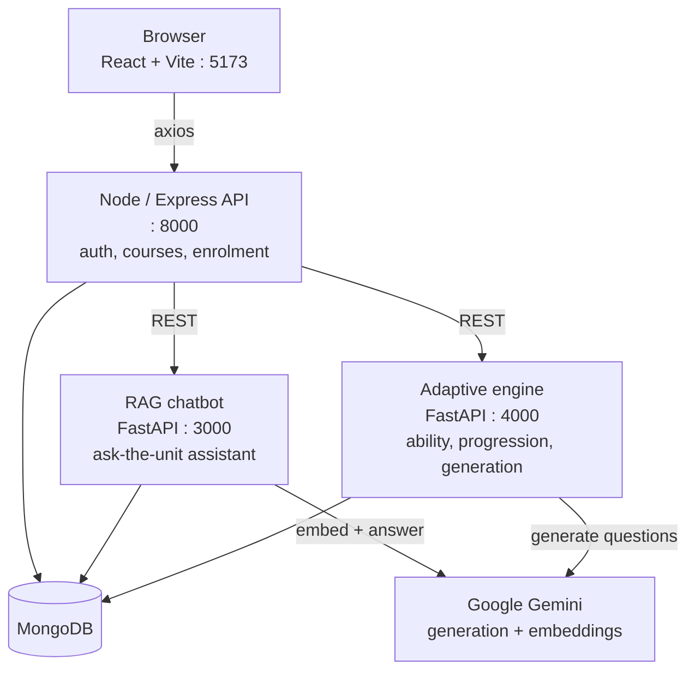

# SikshyakAI

An adaptive e-learning platform. Teachers upload course material; students work
through it one question at a time, and the difficulty, the objective being
practised, and the questions themselves adapt to how each student is doing.

Two things make it adaptive rather than just automated:

- **Questions are generated from the teacher's own material** — the unit outline,
  teaching plan, labs, and text extracted from uploaded PDFs — rather than from
  the model's general knowledge.
- **Difficulty is chosen per student per learning objective**, from an ability
  estimate that updates after every single answer. It works from a student's
  first question, with no training data and no model file.

---

## Architecture

Four services. The Node backend is the only thing the browser talks to; the two
Python services sit behind it and share the same MongoDB.



| Service | Stack | Port | Responsibility |
|---|---|---|---|
| `frontend/` | React, Vite, TypeScript, Tailwind | 5173 | Student, teacher, HOD and admin dashboards |
| `backend/` | Node, Express, Mongoose | 8000 | Auth, courses, units, enrolment, proxying to the Python services |
| `adaptive_learnings/` | FastAPI, PyMongo, PyTorch | 4000 | Ability estimation, progression, question generation |
| `backend/rag_service/` | FastAPI, Motor, LangChain | 3000 | Retrieval-augmented chat over a unit's documents |

The browser never calls the Python services directly — the Node layer owns
authentication and enrolment checks.

---

## How the adaptation works

Three layers, in increasing order of how much data they need. Each one only takes
over when it has earned it.

### 1. Evidence rules — always on

Every learning objective tracks attempts and correct answers **separately per
difficulty band**, over a rolling window of the last 8 answers at each band.

Mastery is `min(weighted_accuracy, ceiling)`, where the ceiling is set by the
hardest band the student has answered correctly at — `low` caps at 0.65, `mid` at
0.85, `high` at 1.0. Perfect scores on easy questions cannot signal mastery, and
because the window is recent-only, an early mistake stops counting once it ages
out. An objective is complete at 0.80 mastery with at least four attempts and two
of them at high difficulty.

### 2. Online ability model — from the first question

An Elo/IRT estimate that needs no training data at all:

```
P(correct) = sigmoid( θ[student, objective] − b[objective, difficulty] )

θ += K · (observed − P)      # the student is better or worse than we thought
b −= K · (observed − P)      # the question band is easier or harder than rated
```

`K` shrinks as evidence accumulates, so early answers move the estimate a lot and
later ones refine it. The next difficulty is the **hardest band the student is
still predicted to pass at least 60% of the time**.

The `b` term is the interesting half. Questions here are LLM-generated, so a
question labelled "high" is often not actually hard. The band's difficulty is
learned from how students really perform on it, which no amount of prompt tuning
fixes reliably.

Behaviour feeds in alongside correctness: response latency (a sub-second correct
answer earns reduced credit), correct and incorrect streaks, disengagement
detection that lowers difficulty instead of pushing harder, and ability decay
across long gaps so forgetting is modelled.

### 3. SAKT knowledge tracing — advisory until it earns promotion

A self-attentive knowledge-tracing model. It runs and reports predictions, but
does **not** steer difficulty unless it passes a calibration probe at startup and
beats the online model on held-out accuracy.

The bundled checkpoint does not pass, and the service says so on boot. See
[Known limitations](#known-limitations).

---

## Question generation

`POST /api/adaptive/generate-quiz` (one question, adaptive) and
`POST /api/adaptive/generate-assessment` (a whole unit, for teachers).

Both build the prompt from the unit's real content — outline, description,
teaching plan, labs, and PDF text extracts, capped at 12k characters. Output is
validated before it is stored: exactly four options, a correct index in range, no
duplicate options, a difficulty in the enum, and a written explanation. Invalid
responses are retried with backoff rather than saved.

The engine — not the model — decides which objective and difficulty each question
targets, and option order is shuffled so the answer is not always first.

**Answer keys never reach the browser.** The correct index and explanation are
withheld until the question has been submitted.

---

## Getting started

Requires Node 18+, Python 3.11+, MongoDB, and a
[Google AI Studio](https://aistudio.google.com/apikey) key.

```bash
git clone https://github.com/jyotiraut/SikhshyakAI_.git
cd SikhshyakAI_
```

Every service needs its own `.env`; none are committed. Copy the examples and
fill in your own values:

```bash
cp backend/sampleenv                backend/.env
cp adaptive_learnings/.env.example  adaptive_learnings/.env
cp backend/rag_service/.env.example backend/rag_service/.env
```

At minimum set `MONGODB_URI`, `JWT_SECRET`, and `GEMINI_API_KEY`
(`GOOGLE_API_KEY` for the RAG service). The adaptive engine **will not start**
without a Gemini key — the generator is constructed at import time.

Run each service in its own terminal:

```bash
# Node API            -> :8000
cd backend && npm install && npm run dev

# Adaptive engine     -> :4000
cd adaptive_learnings && pip install -r requirements.txt && python main.py

# RAG chatbot         -> :3000
cd backend/rag_service && pip install -r requirements.txt && python -m app.main

# Frontend            -> :5173
cd frontend && npm install && npm run dev
```

### Seed the default accounts

```bash
cd backend && npm run seed:admins
```

| Role | Email | Password |
|---|---|---|
| superadmin | `superadmin@shikshyak.ai` | `SuperAdmin@123` |
| admin | `admin@shikshyak.ai` | `Admin@123` |
| hod | `hod@shikshyak.ai` | `Hod@123` |

Override these with the `SEED_*` variables in `backend/sampleenv`, and change
them before deploying anywhere real.

### Tests

```bash
cd adaptive_learnings && pytest tests/     # 30 tests, no DB or API key needed
```

MongoDB is stubbed with `mongomock`, so the suite runs offline.

---

## Training the knowledge-tracing model

The model learns from this platform's own interactions — not a public dataset,
whose skill IDs would describe skills these courses do not have.

```bash
cd adaptive_learnings
python training/train_sakt.py --dry-run   # how much more data is needed
python training/train_sakt.py             # train, evaluate, promote if better
```

It needs 2,000 interactions across 20 students and refuses to train below that.
A trained model is a *challenger*: it is scored against the online ability model
on a chronological held-out split and only promoted if it wins by a clear margin.
Finishing training earns it nothing on its own.

Once promoted, point `MODEL_CHECKPOINT_PATH` at the new file and set
`SAKT_MODE=active`.

---

## Known limitations

- **The bundled SAKT checkpoint is not usable.** It was trained to predict
  mastery, difficulty and pace directly — none of which have ground truth — and
  the feature scaler it needs at inference was never saved, so its difficulty
  head saturates and it cannot separate a struggling student from a strong one.
  The startup probe detects this and holds it in advisory mode. Retrain with
  `training/train_sakt.py` to replace it.
- **The adaptive engine has not been run against a production MongoDB.** Logic is
  covered by the test suite against an in-memory database and simulated students.
- Hint usage is not tracked, so the model treats incorrect answers as its proxy.
- `adaptive_learnings/api/routes.py` is a deprecated second FastAPI app kept for
  reference. Nothing mounts it.

---

## License

Released under the **MIT License** — see [LICENSE](frontend/LICENSE).

> **Note:** licensing is currently inconsistent across the repo. `frontend/LICENSE`
> is MIT (© 2025 Avash Mani Dahal) while `backend/package.json` declares ISC with a
> different author. Pick one, move the `LICENSE` file to the repository root, and
> make the `package.json` fields agree before publishing or accepting contributions.
